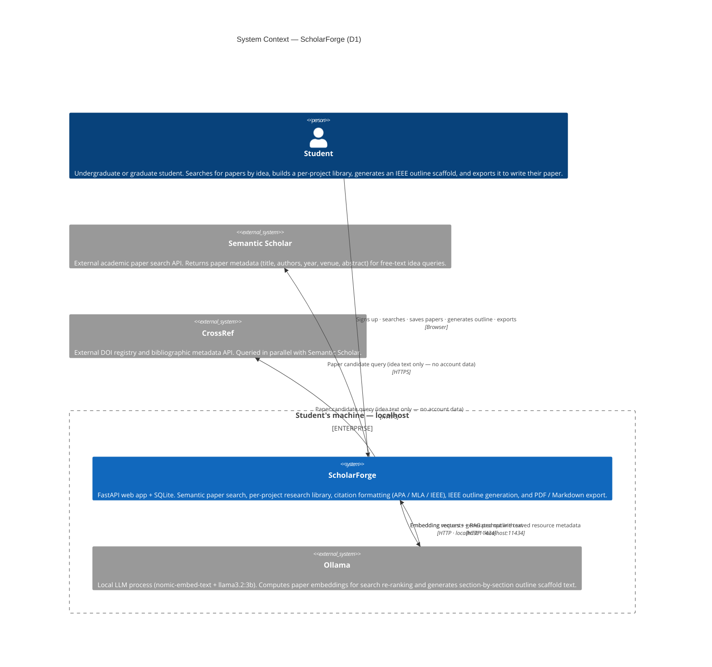

# Diagram 0 — System Context (D1)

**Trust boundary** — the `Enterprise_Boundary` marks what stays on the student's machine. Only the idea-text search query crosses the boundary (to Semantic Scholar and CrossRef); account credentials, saved library content, and outline text never leave localhost.

**Ollama note** — Ollama is a separately-deployed process the student installs independently. ScholarForge pings it before generation (GENC-FR-02); if unreachable, it shows a specific "Start Ollama" error rather than a hang.
