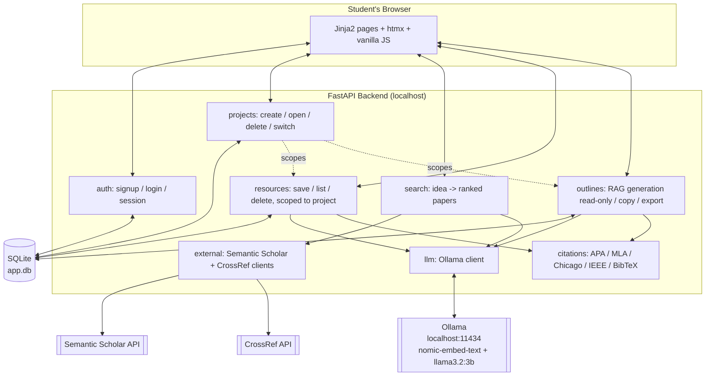

# Diagram 1 — System Architecture

Everything runs as a single process on the student's own machine (`localhost`) — no cloud hosting, no third-party identity provider, no external LLM API.

**Trust boundary**: only `Ext` (Semantic Scholar/CrossRef) crosses the machine boundary, and it only ever sends the search query text — never account data, saved-library content, or generated outline text. Auth, storage, and the LLM stay entirely local.

**Scoping**: every `Resources` and `Outlines` row carries a `project_id`; `Projects` is the boundary that keeps different assignments from mixing (BL-32–BL-35). Deleting a project cascades to both.
