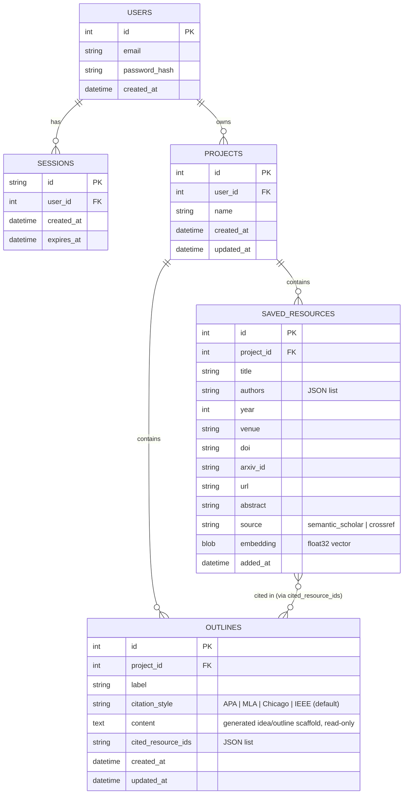

# Diagram 2 — Entity-Relationship Diagram

Updated to add **Projects** as the scoping boundary: saved resources and generated outlines belong to a project, not directly to a user, so different assignments never mix (BL-32–BL-35).

**Notes**:
- `SAVED_RESOURCES` has a uniqueness constraint on `(project_id, doi)` and `(project_id, arxiv_id)` — scoped per project (BL-11), not per account, so the same paper can legitimately be saved into two different projects.
- Renamed `PROPOSALS` → `OUTLINES` to match the reframed scope: this table holds a read-only generated idea/outline scaffold (bullet points + short example passages), not an editable finished paper — there is no rich-text editing surface, so `content` is written once per generation/regeneration, never hand-edited in place.
- Deleting a `PROJECTS` row cascades to delete all of its `SAVED_RESOURCES` and `OUTLINES` rows (BL-34); other projects are untouched.
- Search results are still never persisted — only rows a user explicitly saves become `SAVED_RESOURCES`.
