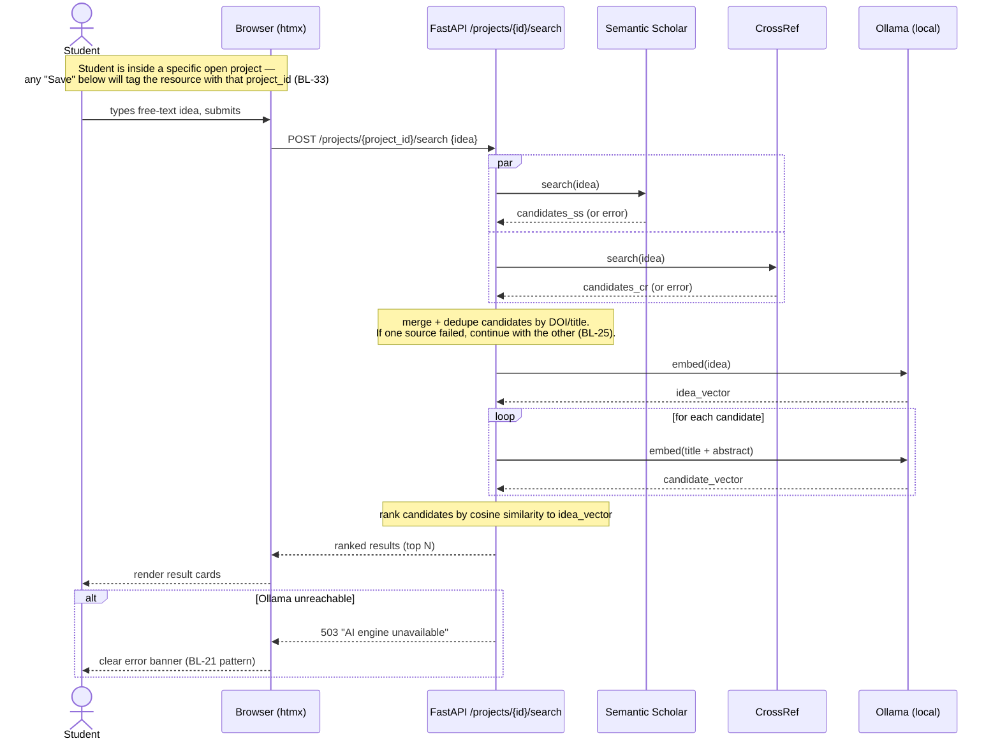

# Diagram 3 — Sequence: Idea-Based Semantic Search

Covers BL-05 / BL-06 / BL-07 / BL-25 (partial-result degradation).

```mermaid
sequenceDiagram
    actor Student
    participant UI as Browser (htmx)
    participant API as FastAPI /projects/{id}/search
    participant SS as Semantic Scholar
    participant CR as CrossRef
    participant Ollama as Ollama (local)

    Note over Student,UI: Student is inside a specific open project —<br/>any "Save" below will tag the resource with that project_id (BL-33)
    Student->>UI: types free-text idea, submits
    UI->>API: POST /projects/{project_id}/search {idea}
    par
        API->>SS: search(idea)
        SS-->>API: candidates_ss (or error)
    and
        API->>CR: search(idea)
        CR-->>API: candidates_cr (or error)
    end
    Note over API: merge + dedupe candidates by DOI/title.<br/>If one source failed, continue with the other (BL-25).
    API->>Ollama: embed(idea)
    Ollama-->>API: idea_vector
    loop for each candidate
        API->>Ollama: embed(title + abstract)
        Ollama-->>API: candidate_vector
    end
    Note over API: rank candidates by cosine similarity to idea_vector
    API-->>UI: ranked results (top N)
    UI-->>Student: render result cards

    alt Ollama unreachable
        API-->>UI: 503 "AI engine unavailable"
        UI-->>Student: clear error banner (BL-21 pattern)
    end
```
