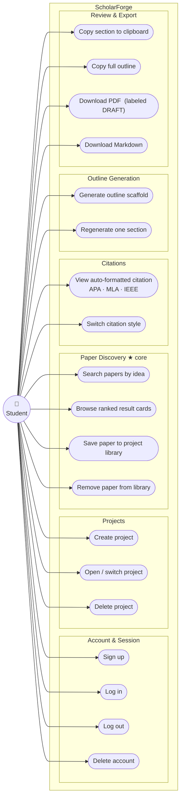

# Diagram 5 — Use-Case / User-Story Map (D2)

**One actor** — the entire product serves a single human role (Student). No admin, no supervisor, no compliance officer interacts with the app directly; compliance obligations (CCA §26 logging, PDPA deletion) are met by system behaviour, not a separate actor.

**★ core** marks the Paper Discovery group — the feature the audit confirmed as build-first, and the one all other groups depend on (you need saved papers before you can cite, generate, or export anything).
