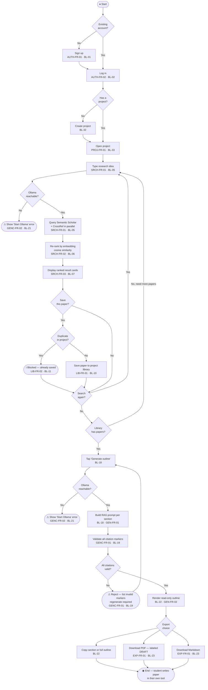

# Diagram 6 — Activity: Core Workflow (D4)

End-to-end student journey from app open to outline export.
Each node traces to at least one spec requirement.

**Loops**
- `Search again → Type idea` — iterative research; student deepens or pivots the query without losing the saved library.
- `No papers in library → Type idea` — guard before generation; prevents generating from an empty context.
- `Invalid citations → Generate` — GENC-FR-01 rejection forces a clean retry; no partially-verified outline is ever shown.

**Error exits** (⚠ nodes) are terminal per-path — the student must fix the upstream condition (start Ollama, rephrase idea) before the main flow resumes. They are not shown connecting to `End` because the session is still active.

**Scope boundary** — `End` is the deliberate handoff point: the student takes the scaffold to their own word processor. Nothing in ScholarForge continues after export (no in-app editor — BL-22 / Won't-for-v1).
